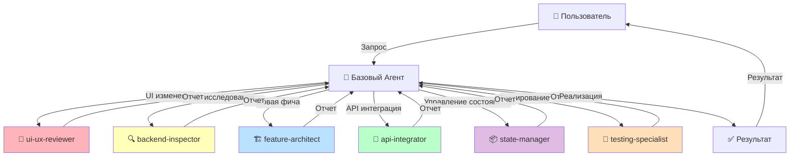
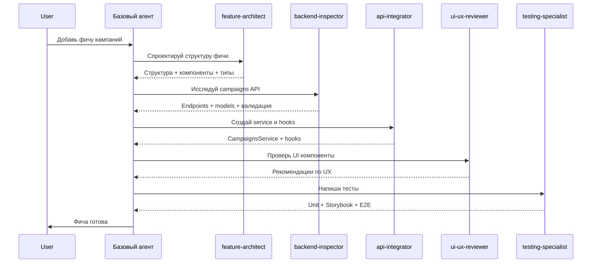
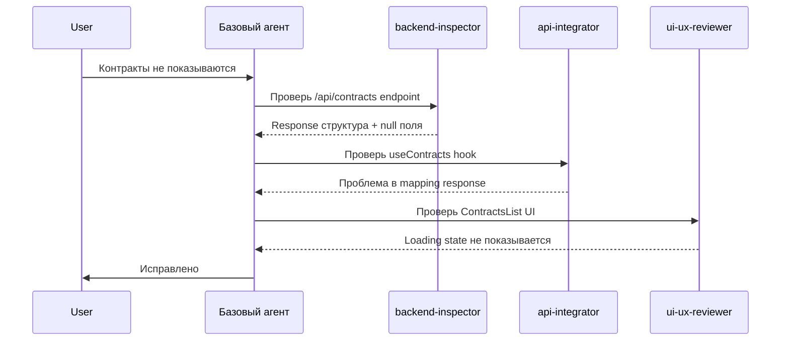
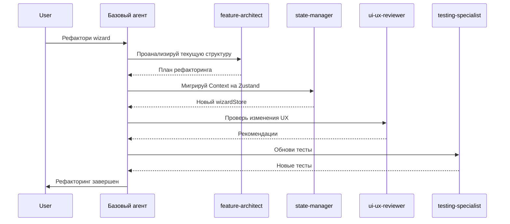
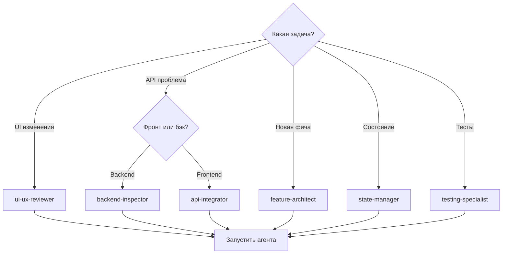

# 🤖 Система Агентов AdLawyerFront

Comprehensive документация по системе специализированных агентов для разработки проекта VK ORD Frontend.

---

## 📋 Содержание

1. [Обзор системы агентов](#обзор-системы-агентов)
2. [Существующие агенты](#существующие-агенты)
3. [Рекомендуемые дополнительные агенты](#рекомендуемые-дополнительные-агенты)
4. [Сценарии взаимодействия агентов](#сценарии-взаимодействия-агентов)
5. [Правила использования агентов](#правила-использования-агентов)
6. [Конфигурация агентов](#конфигурация-агентов)
7. [Расширение системы агентов](#расширение-системы-агентов)
8. [Метрики эффективности](#метрики-эффективности)
9. [Быстрая справочная таблица](#быстрая-справочная-таблица)

---

## 🎯 Обзор системы агентов

### Концепция

Система агентов AdLawyerFront — это архитектурный подход к разработке, при котором **базовый агент** (senior agent) делегирует специализированные задачи **узкоспециализированным агентам**. Каждый агент является экспертом в своей области и предоставляет глубокий анализ, рекомендации и решения.

### Принципы работы

1. **Специализация**: Каждый агент отвечает за конкретную область (UI/UX, backend API, архитектура фич, тестирование и т.д.)
2. **Проактивность**: Базовый агент должен автоматически запускать специализированных агентов при выполнении задач в их области
3. **Автономность**: Агенты работают независимо и возвращают структурированный отчет базовому агенту
4. **Модульность**: Система легко расширяется добавлением новых агентов

### Архитектурная диаграмма



---

## 🎨 Существующие агенты

### 1. ui-ux-reviewer

**Файл**: `.claude/agents/ui-ux-reviewer.md`
**Модель**: `sonnet`
**Цвет**: `pink` (🟣)

#### Роль

Элитный UI/UX дизайн-ревьюер, специализирующийся на React приложениях и оптимизации пользовательского опыта. Эксперт по Material UI, shadcn/ui, Tailwind CSS и современным стандартам веб-доступности.

#### Когда использовать

- ✅ Базовый агент планирует изменения пользовательского интерфейса
- ✅ Добавление новых UI компонентов (формы, кнопки, модалы)
- ✅ Изменение layout или структуры страниц
- ✅ Модификация паттернов взаимодействия (error handling, toast notifications)
- ✅ Рефакторинг существующих компонентов

#### Ключевые проверки

**Usability Checklist:**
- Интуитивность для русскоязычных пользователей
- Соответствие установленным паттернам приложения
- Четкая коммуникация error states
- Очевидность happy path
- Корректная обработка loading states

**Accessibility Checklist:**
- Правильная разметка form inputs
- Логичная клавиатурная навигация
- Достаточный контраст цветов (WCAG AA)
- Screen-reader friendly сообщения об ошибках
- Минимум 44x44px для touch targets

**Consistency Checklist:**
- Соответствие Material UI design language
- Следование конвенции именования `vk-` классов
- Консистентность spacing с Tailwind utilities
- Единообразная обработка похожих взаимодействий

**VK ORD Domain Checklist:**
- Поддержка wizard flow (contract → creative → ERID)
- Учет российских правовых требований (ИНН, ККТУ, ERID)
- Обработка переключения sandbox/production
- Четкость отношений counterparty и contract

#### Пример использования

```
user: "Мне нужно добавить поле для длительности контракта в wizard"
base_agent: "Я собираюсь добавить TextField компонент в ContractDetailsStep для длительности контракта"
assistant: "Прежде чем реализовать это изменение, давай проконсультируюсь с ui-ux-reviewer агентом"

[Запуск ui-ux-reviewer через Task tool]
```

#### Формат вывода

```markdown
## UI/UX Review: [Краткое описание]

### Proposed Changes Summary
[Краткая сводка того, что планирует сделать базовый агент]

### Analysis
**Strengths:**
- [Что работает хорошо]

**Concerns:**
- [Проблемы usability]
- [Пробелы accessibility]
- [Проблемы consistency]

### Suggested Improvements
1. **[Название улучшения]**
   - Problem: [Какую проблему это решает]
   - Solution: [Конкретная рекомендация]
   - Implementation: [Компонент/паттерн для использования]
   - Priority: [Critical/High/Medium/Low]

### Alternative Approaches
**Option A: [Название]**
- Description: [Как это работает]
- Pros: [Преимущества]
- Cons: [Недостатки]
- Components: [Конкретные MUI/shadcn компоненты]

### Recommendation for Senior Agent
[Четкая, actionable сводка того, что следует одобрить, изменить или пересмотреть]
```

---

### 2. backend-inspector

**Файл**: `.claude/agents/backend-inspector.md`
**Модель**: `haiku`
**Цвет**: `yellow` (🟡)

#### Роль

Эксперт-системный аналитик, специализирующийся на ASP.NET Core backend архитектурах, паттернах дизайна API и C# кодовых базах. Исследует и объясняет детали реализации backend, расположенного в `C:\PROGECTS\My\AdLawyer\AdLawyerApi`.

#### Когда использовать

- ✅ Отладка проблем с API вызовами (неожиданные данные, null значения)
- ✅ Понимание структуры данных перед реализацией frontend фичи
- ✅ Исследование backend валидации (INN, KKTU, контракты)
- ✅ Анализ Broken Rules ошибок (400 с кодами ошибок)
- ✅ Изучение моделей и DTO для TypeScript типизации

#### Основные задачи

**Controller Analysis:**
- HTTP endpoint routes и методы (GET, POST, PUT, DELETE)
- Типы параметров запросов (route params, query params, body models)
- Authorization и authentication требования
- Назначение endpoint и flow бизнес-логики

**Model Investigation:**
- Имена свойств, типы и атрибуты (Required, MaxLength и т.д.)
- Правила валидации и ограничения
- Отношения между моделями
- Поведение сериализации (JsonPropertyName, JsonIgnore)
- Паттерны конвертации case (snake_case vs camelCase)

**Implementation Deep-Dive:**
- Вызовы service layer и dependency injection
- Database запросы и Entity Framework операции
- Бизнес-логика и правила валидации
- Error handling и exception паттерны
- Конструирование response и status codes

**Response Analysis:**
- Success response модели и status codes
- Форматы error responses (особенно BrokenRule arrays)
- Nullable поля и optional данные
- Pagination, filtering и sorting поведение

#### Пример использования

```
user: "Почему /api/v1/contracts endpoint возвращает null для creativeIds?"
assistant: "Давай используем backend-inspector агент для исследования реализации contracts controller"

[Запуск backend-inspector через Task tool с запросом о contracts endpoint и поле creativeIds]
```

#### Формат вывода

```markdown
## Backend Investigation: [Описание запроса]

### Direct Answer
[Конкретная информация, запрошенная пользователем]

### Code Evidence
[Релевантные фрагменты кода с file paths и line numbers]
file_path:line_number

### Context
[Объяснение, как это вписывается в более широкую архитектуру]

### Related Information
[Связанные endpoints, models или services, которые могут быть релевантны]

### Frontend Implications
[Как это влияет на frontend реализацию (case conversion, error handling и т.д.)]
```

---

## 🚀 Рекомендуемые дополнительные агенты

### 3. feature-architect

**Файл**: `.claude/agents/feature-architect.md` *(планируется)*
**Модель**: `sonnet`
**Цвет**: `blue` (🔵)

#### Роль

Эксперт по проектированию feature-based архитектуры. Специализируется на структурировании новых фич в `src/features/`, определении компонентов, hooks, services и интеграции с существующим кодом.

#### Когда использовать

- ✅ Добавление новой бизнес-функции (новый раздел dashboard)
- ✅ Крупный рефакторинг существующей фичи
- ✅ Планирование интеграции нескольких фич
- ✅ Миграция legacy кода в feature-based структуру

#### Основные задачи

- Проектирование структуры новых фич в `src/features/`
- Определение необходимых компонентов, hooks, services
- Планирование TypeScript типов
- Интеграция с существующими фичами
- Соблюдение паттернов проекта

#### Шаблон структуры фичи

```
src/features/
├── feature-name/
│   ├── FeatureNamePage.tsx        # Главный компонент страницы
│   ├── components/                 # UI компоненты фичи
│   │   ├── FeatureList.tsx
│   │   ├── FeatureEditor.tsx
│   │   └── FeatureModal.tsx
│   ├── hooks/                      # React Query hooks
│   │   ├── useFeatureList.ts
│   │   ├── useCreateFeature.ts
│   │   └── useUpdateFeature.ts
│   ├── schemas/                    # Zod validation schemas
│   │   └── featureSchema.ts
│   └── utils/                      # Утилиты фичи
│       └── featureMapper.ts
```

#### Пример использования

```
user: "Нужно добавить новую фичу для управления рекламными кампаниями"
base_agent: "Это крупная новая фича. Запущу feature-architect для проектирования структуры"

[Запуск feature-architect с деталями требований]
```

#### Формат вывода

```markdown
## Feature Architecture: [Название фичи]

### Proposed Structure
[Дерево файлов и папок]

### Components
- **FeaturePage.tsx**: [Описание]
- **FeatureList.tsx**: [Описание]
- **FeatureEditor.tsx**: [Описание]

### Hooks
- **useFeatureList**: [Описание, query keys]
- **useCreateFeature**: [Описание, mutations]

### Types
[TypeScript интерфейсы и типы]

### Integration Points
- [Какие существующие фичи затрагиваются]
- [Новые API endpoints]
- [Zustand stores, если нужны]

### Recommendations
[Советы по реализации, best practices]
```

---

### 4. api-integrator

**Файл**: `.claude/agents/api-integrator.md` *(планируется)*
**Модель**: `haiku`
**Цвет**: `green` (🟢)

#### Роль

Эксперт по интеграции с backend API через React Query и Axios. Создает service классы, разрабатывает React Query hooks, настраивает cache invalidation и обрабатывает ошибки.

#### Когда использовать

- ✅ Создание новых API hooks (useContracts, useCreatives)
- ✅ Разработка service классов в `src/services/`
- ✅ Настройка React Query cache стратегий
- ✅ Обработка Broken Rules ошибок
- ✅ Интеграция новых endpoints

#### Паттерны кода

**Service класс:**
```typescript
// src/services/myService.ts
import { http } from '@/api/http'
import { MyModel } from '@/types'

export class MyService {
  static async getList(): Promise<MyModel[]> {
    const response = await http.get<MyModel[]>('/api/my-endpoint')
    return response.data
  }

  static async create(data: Partial<MyModel>): Promise<MyModel> {
    const response = await http.post<MyModel>('/api/my-endpoint', data)
    return response.data
  }
}
```

**React Query hook:**
```typescript
// src/features/my-feature/hooks/useMyData.ts
import { useQuery } from '@tanstack/react-query'
import { MyService } from '@/services/myService'

export const useMyData = () => {
  return useQuery({
    queryKey: ['myData'],
    queryFn: MyService.getList,
    staleTime: 5 * 60 * 1000, // 5 minutes
  })
}
```

**Mutation hook:**
```typescript
// src/features/my-feature/hooks/useCreateMyData.ts
import { useMutation, useQueryClient } from '@tanstack/react-query'
import { MyService } from '@/services/myService'
import { toast } from 'react-toastify'

export const useCreateMyData = () => {
  const queryClient = useQueryClient()

  return useMutation({
    mutationFn: MyService.create,
    onSuccess: () => {
      queryClient.invalidateQueries({ queryKey: ['myData'] })
      toast.success('Данные успешно созданы')
    },
    onError: (error: any) => {
      toast.error(error.message || 'Ошибка при создании данных')
    },
  })
}
```

#### Важные особенности

- **Автоматическая конвертация case**: НЕ делать вручную camelCase/snake_case конвертацию
- **Заголовки**: Authorization, x-api-vk-env, x-vkord-credential-id автоматически добавляются
- **Broken Rules**: Backend возвращает массив с кодами ошибок, http client их маппит
- **Token refresh**: Автоматический механизм в http.ts

#### Пример использования

```
user: "Нужно создать API integration для новой фичи campaigns"
base_agent: "Запущу api-integrator для создания service и hooks"

[Запуск api-integrator с деталями API endpoints]
```

---

### 5. state-manager

**Файл**: `.claude/agents/state-manager.md` *(планируется)*
**Модель**: `haiku`
**Цвет**: `purple` (🟣)

#### Роль

Эксперт по client-side state management с Zustand. Проектирует stores, интегрирует persist middleware, оптимизирует re-renders и мигрирует с Context API.

#### Когда использовать

- ✅ Создание новых Zustand stores
- ✅ Рефакторинг Context API на Zustand
- ✅ Оптимизация re-renders через селекторы
- ✅ Настройка localStorage/sessionStorage persistence
- ✅ Синхронизация состояния между компонентами

#### Существующие stores

**Примеры в проекте:**
- `src/auth/tokenStore.ts`: useTokenStore, useDeviceStore, useEnvironmentStore
- `src/stores/wizardStore.ts`: сложный store с persist middleware

**Legacy:**
- `src/context/AppContext.tsx`: useReducer-based context (кандидат для миграции)

#### Паттерны кода

**Базовый Zustand store:**
```typescript
import { create } from 'zustand'

interface MyState {
  count: number
  increment: () => void
  decrement: () => void
}

export const useMyStore = create<MyState>((set) => ({
  count: 0,
  increment: () => set((state) => ({ count: state.count + 1 })),
  decrement: () => set((state) => ({ count: state.count - 1 })),
}))
```

**Store с persist middleware:**
```typescript
import { create } from 'zustand'
import { persist } from 'zustand/middleware'

interface MyPersistedState {
  user: User | null
  setUser: (user: User) => void
}

export const useUserStore = create<MyPersistedState>()(
  persist(
    (set) => ({
      user: null,
      setUser: (user) => set({ user }),
    }),
    {
      name: 'user-storage',
    }
  )
)
```

**Селекторы для оптимизации:**
```typescript
// ❌ Плохо - ререндер при любом изменении в store
const { user, settings, notifications } = useAppStore()

// ✅ Хорошо - ререндер только при изменении user
const user = useAppStore((state) => state.user)
```

#### Важные особенности

- **Zustand vs React Query**: Zustand для client state, React Query для server state
- **localStorage vs sessionStorage**: persist для долгосрочного, sessionStorage для временного
- **Избегать излишних re-renders**: использовать селекторы
- **Паттерны сброса**: метод reset() или resetAll()

#### Пример использования

```
user: "Нужно создать глобальное состояние для настроек пользователя"
base_agent: "Запущу state-manager для проектирования Zustand store"

[Запуск state-manager с требованиями к состоянию]
```

---

### 6. testing-specialist

**Файл**: `.claude/agents/testing-specialist.md` *(планируется)*
**Модель**: `haiku`
**Цвет**: `orange` (🟠)

#### Роль

Эксперт по тестированию React приложений. Пишет unit тесты с Vitest, создает Storybook stories, настраивает integration и E2E тесты, проверяет accessibility.

#### Когда использовать

- ✅ Написание unit тестов для компонентов и hooks
- ✅ Создание Storybook stories для UI компонентов
- ✅ Настройка integration тестов для фич
- ✅ E2E тесты с Playwright
- ✅ Accessibility тестирование

#### Тестовая инфраструктура

**Доступные инструменты:**
- **Vitest**: Unit тесты (см. `package.json` scripts)
- **Storybook**: Component stories (см. `.storybook/` и `src/components/*.stories.tsx`)
- **Playwright**: E2E тесты
- **Testing Library**: React компонент тестирование

#### Паттерны тестирования

**Unit test для компонента:**
```typescript
// src/components/__tests__/MyComponent.test.tsx
import { render, screen } from '@testing-library/react'
import { MyComponent } from '../MyComponent'

describe('MyComponent', () => {
  it('renders correctly', () => {
    render(<MyComponent title="Test" />)
    expect(screen.getByText('Test')).toBeInTheDocument()
  })

  it('handles click event', async () => {
    const handleClick = vi.fn()
    render(<MyComponent onClick={handleClick} />)

    await userEvent.click(screen.getByRole('button'))
    expect(handleClick).toHaveBeenCalledTimes(1)
  })
})
```

**Storybook story:**
```typescript
// src/components/MyComponent.stories.tsx
import type { Meta, StoryObj } from '@storybook/react'
import { MyComponent } from './MyComponent'

const meta: Meta<typeof MyComponent> = {
  title: 'Components/MyComponent',
  component: MyComponent,
  tags: ['autodocs'],
}

export default meta
type Story = StoryObj<typeof MyComponent>

export const Default: Story = {
  args: {
    title: 'Default Title',
    variant: 'primary',
  },
}

export const Secondary: Story = {
  args: {
    title: 'Secondary',
    variant: 'secondary',
  },
}
```

**Мокирование API:**
```typescript
// Мокирование React Query
import { QueryClient, QueryClientProvider } from '@tanstack/react-query'

const createTestQueryClient = () => new QueryClient({
  defaultOptions: {
    queries: { retry: false },
    mutations: { retry: false },
  },
})

// Мокирование Zustand
import { useMyStore } from '@/stores/myStore'

vi.mock('@/stores/myStore')
const mockUseMyStore = vi.mocked(useMyStore)
mockUseMyStore.mockReturnValue({
  user: { id: '1', name: 'Test User' },
  setUser: vi.fn(),
})
```

#### Существующие примеры

- `src/components/PageLoader.stories.tsx`
- `src/components/EmptyState.stories.tsx`
- `src/components/ui/button.stories.tsx`

#### Пример использования

```
user: "Напиши тесты для новой фичи campaigns"
base_agent: "Запущу testing-specialist для создания тестового покрытия"

[Запуск testing-specialist с описанием фичи]
```

---

## 🔄 Сценарии взаимодействия агентов

### Сценарий 1: Добавление новой фичи

**Задача**: Добавить фичу "Управление рекламными кампаниями"

**Последовательность агентов:**



**Детали:**

1. **feature-architect** проектирует:
   - Структуру `src/features/campaigns/`
   - Компоненты: CampaignsPage, CampaignList, CampaignEditor
   - Hooks: useCampaigns, useCreateCampaign, useUpdateCampaign
   - Types: Campaign, CampaignStatus, CampaignFormData

2. **backend-inspector** исследует:
   - `/api/campaigns` endpoints (GET, POST, PUT, DELETE)
   - Campaign model (свойства, валидация)
   - Связи с другими моделями (contracts, creatives)

3. **api-integrator** создает:
   - `src/services/campaigns.ts` с CampaignsService
   - `src/features/campaigns/hooks/` с React Query hooks
   - Cache invalidation стратегию

4. **ui-ux-reviewer** проверяет:
   - Консистентность с Material UI
   - Accessibility (ARIA labels, keyboard navigation)
   - Русскоязычный UX
   - VK ORD domain специфику

5. **testing-specialist** пишет:
   - Unit тесты для компонентов
   - Storybook stories
   - Integration тесты для фичи
   - E2E тесты для критичных флоу

---

### Сценарий 2: Отладка бага

**Задача**: Контракты не отображаются в списке

**Последовательность агентов:**



**Детали:**

1. **backend-inspector**:
   - Исследует ContractsController
   - Проверяет response model
   - Находит, что `creatives` может быть null

2. **api-integrator**:
   - Проверяет `useContracts` hook
   - Находит проблему в TypeScript типе (не учтен null)
   - Предлагает фикс: `creatives?: Creative[] | null`

3. **ui-ux-reviewer**:
   - Проверяет ContractsList компонент
   - Находит, что loading state не отображается
   - Рекомендует добавить Skeleton loader

---

### Сценарий 3: Рефакторинг

**Задача**: Рефакторинг wizard на современные паттерны

**Последовательность агентов:**



**Детали:**

1. **feature-architect**:
   - Анализирует `src/context/AppContext.tsx` (legacy)
   - Планирует миграцию на `src/stores/wizardStore.ts`
   - Предлагает разделение на smaller stores

2. **state-manager**:
   - Создает новый Zustand store с persist
   - Мигрирует reducer actions в Zustand methods
   - Оптимизирует селекторы для performance

3. **ui-ux-reviewer**:
   - Проверяет, что UX не пострадал
   - Рекомендует улучшения в wizard flow
   - Предлагает добавить progress indicator

4. **testing-specialist**:
   - Обновляет тесты для новых stores
   - Добавляет Storybook stories для wizard steps
   - Пишет E2E тесты для полного wizard flow

---

## 📜 Правила использования агентов

### Для базового агента

1. **Проактивность**: Автоматически запускай специализированных агентов, когда задача попадает в их область ответственности. НЕ жди явного запроса от пользователя.

   ```
   ❌ Плохо:
   user: "Добавь кнопку в форму"
   base_agent: "Добавлю Button компонент"

   ✅ Хорошо:
   user: "Добавь кнопку в форму"
   base_agent: "Это UI изменение. Запущу ui-ux-reviewer для проверки"
   ```

2. **Последовательность**: Запускай агентов в логичном порядке. Например, сначала backend-inspector (понять API), затем api-integrator (создать hooks), затем ui-ux-reviewer (проверить UI).

3. **Специализация**: Доверяй агентам в их области. Не переделывай их рекомендации без веских причин.

4. **Отчетность**: Кратко сообщай пользователю результаты работы каждого агента, но не перегружай деталями.

### Для пользователя

1. **Доверие**: Позволь базовому агенту самостоятельно решать, когда запускать специализированных агентов.

2. **Уточнение**: Предоставляй максимум контекста для точной работы агентов. Например: "Добавь фичу кампаний с поддержкой фильтрации и пагинации".

3. **Итеративность**: Работай итерациями. После получения рекомендаций от агента, можешь уточнить детали.

4. **Обратная связь**: Если агент предлагает неподходящее решение, укажи почему. Это поможет улучшить систему.

---

## ⚙️ Конфигурация агентов

### Структура файла агента

Каждый агент хранится в `.claude/agents/{agent-name}.md` со следующей структурой:

```yaml
---
name: agent-name
description: |
  Подробное описание агента с примерами, когда базовый агент должен его использовать.

  <example>
  Context: [Контекст ситуации]
  user: "[Запрос пользователя]"
  base_agent: "[Планируемое действие]"
  assistant: "[Решение использовать агента]"
  <commentary>
  [Объяснение, почему запускается агент]
  </commentary>
  </example>

  [Больше примеров...]
model: sonnet | haiku
color: pink | yellow | blue | green | purple | orange
tools: [опционально, список доступных tools]
---

# Основное содержимое агента

## Your Primary Responsibilities
[Детальное описание обязанностей]

## Your Analytical Framework
[Checklists, фреймворки для анализа]

## Your Output Format
[Формат отчета]

## Important Constraints
[Ограничения и важные соображения]

## When to Escalate
[Когда обращаться к базовому агенту]

## Your Communication Style
[Стиль коммуникации]
```

### Рекомендации по выбору моделей

| Задача агента | Рекомендуемая модель | Обоснование |
|---------------|----------------------|-------------|
| Сложный анализ, архитектура, дизайн | `sonnet` | Требуется глубокое понимание и креативность |
| Code generation, API integration | `haiku` | Быстрая работа, более низкая стоимость |
| Тестирование, рутинные задачи | `haiku` | Эффективно для повторяющихся паттернов |
| UX/UI review с творческими решениями | `sonnet` | Требуется понимание пользователя и креативность |

### Примеры описания агентов

**Хорошее описание (проактивное):**
```yaml
description: |
  Use this agent when the base agent is planning to make changes to state management.

  <example>
  Context: Base agent needs to create new global state
  user: "Add user preferences state"
  base_agent: "I'll create a new Context"
  assistant: "Let me use state-manager to design a Zustand store instead"
  </example>
```

**Плохое описание (пассивное):**
```yaml
description: |
  This agent helps with state management if you need it.
```

---

## 🔧 Расширение системы агентов

### Инструкция по добавлению нового агента

1. **Определите область ответственности**
   - Какую задачу агент будет решать?
   - Какие знания и паттерны он должен знать?
   - Когда базовый агент должен его запускать?

2. **Создайте файл агента**
   ```bash
   touch .claude/agents/my-new-agent.md
   ```

3. **Заполните frontmatter**
   ```yaml
   ---
   name: my-new-agent
   description: |
     [Детальное описание с примерами]
   model: sonnet | haiku
   color: [выберите цвет для визуальной идентификации]
   ---
   ```

4. **Опишите ответственности**
   - Список основных задач
   - Checklists для анализа
   - Формат вывода

5. **Добавьте примеры использования**
   - Минимум 3-4 примера с контекстом
   - Покажите, когда НЕ использовать агента

6. **Обновите документацию**
   - Добавьте агента в `agents.md`
   - Обновите Quick Reference таблицу
   - Добавьте в сценарии взаимодействия

7. **Протестируйте**
   - Запустите агента вручную через Task tool
   - Проверьте качество вывода
   - Уточните описание при необходимости

### Идеи для будущих агентов

#### performance-optimizer

**Модель**: `sonnet`
**Цвет**: `red` (🔴)

**Ответственность**: Анализирует производительность React приложения, находит bottlenecks, предлагает оптимизации (memoization, code splitting, lazy loading, bundle size).

**Когда использовать**: Performance проблемы, slow renders, large bundle size, optimization tasks.

---

#### security-auditor

**Модель**: `sonnet`
**Цвет**: `dark-red` (🔒)

**Ответственность**: Проверяет безопасность кода, находит уязвимости (XSS, CSRF, token exposure, insecure dependencies), предлагает fixes.

**Когда использовать**: Security review, перед продакшеном, после изменений в auth/API.

---

#### documentation-writer

**Модель**: `haiku`
**Цвет**: `cyan` (🔷)

**Ответственность**: Создает и обновляет документацию (README, CLAUDE.md, JSDoc комментарии, API docs, tutorials).

**Когда использовать**: Добавление новых фич, рефакторинг, onboarding новых разработчиков.

---

#### migration-specialist

**Модель**: `sonnet`
**Цвет**: `magenta` (🔮)

**Ответственность**: Планирует и выполняет миграции (React Router v6→v7, Material UI v5→v6, Context→Zustand, class components→functional).

**Когда использовать**: Upgrade dependencies, рефакторинг на новые паттерны.

---

#### accessibility-expert

**Модель**: `sonnet`
**Цвет**: `light-blue` (♿)

**Ответственность**: Глубокий accessibility audit (WCAG AAA, screen readers, keyboard navigation, ARIA, focus management).

**Когда использовать**: Accessibility issues, перед релизом, государственные проекты.

---

#### vk-ord-domain-expert

**Модель**: `sonnet`
**Цвет**: `gold` (⭐)

**Ответственность**: Эксперт по VK ORD специфике (ERID generation flow, INN validation, KKTU codes, российское законодательство о рекламе).

**Когда использовать**: Вопросы по VK ORD бизнес-логике, compliance проверки.

---

## 📊 Метрики эффективности

### Критерии оценки работы агентов

1. **Точность рекомендаций**
   - ✅ Рекомендации применимы и работают
   - ✅ Учтены особенности проекта
   - ✅ Нет breaking changes без предупреждения

2. **Полнота анализа**
   - ✅ Рассмотрены все релевантные аспекты
   - ✅ Предложены альтернативы
   - ✅ Указаны trade-offs

3. **Ясность коммуникации**
   - ✅ Структурированный вывод
   - ✅ Понятные объяснения
   - ✅ Практические примеры кода

4. **Скорость работы**
   - ✅ Быстрый ответ (особенно для haiku агентов)
   - ✅ Не запрашивает избыточную информацию
   - ✅ Фокусируется на главном

### Процесс обратной связи и улучшения

1. **Сбор feedback**
   - После каждого использования агента, оцени результат (👍/👎)
   - Записывай проблемы и улучшения в `agents.md`

2. **Итерация**
   - Обновляй описания агентов на основе опыта
   - Добавляй новые примеры использования
   - Уточняй analytical frameworks

3. **A/B тестирование**
   - Пробуй разные модели (sonnet vs haiku) для одной задачи
   - Сравнивай качество и скорость
   - Выбирай оптимальную конфигурацию

---

## 📑 Быстрая справочная таблица

| Агент | Когда использовать | Модель | Цвет |
|-------|-------------------|--------|------|
| **ui-ux-reviewer** | UI/UX изменения, новые компоненты, layout рефакторинг | `sonnet` | 🟣 pink |
| **backend-inspector** | Исследование API, debugging backend, понимание моделей | `haiku` | 🟡 yellow |
| **feature-architect** | Новые фичи, крупный рефакторинг, архитектурное планирование | `sonnet` | 🔵 blue |
| **api-integrator** | Создание service/hooks, React Query setup, API integration | `haiku` | 🟢 green |
| **state-manager** | Zustand stores, Context→Zustand миграция, state optimization | `haiku` | 🟣 purple |
| **testing-specialist** | Unit/E2E тесты, Storybook stories, test coverage | `haiku` | 🟠 orange |

### Как выбрать агента?



---

## 🎓 Заключение

Система агентов AdLawyerFront — это мощный инструмент для ускорения разработки и повышения качества кода. Проактивное использование специализированных агентов позволяет:

- ✅ Получать экспертные рекомендации в каждой области
- ✅ Избегать типичных ошибок и anti-patterns
- ✅ Поддерживать высокий стандарт кода
- ✅ Ускорять разработку новых фич
- ✅ Улучшать документацию и тестовое покрытие

**Следующие шаги:**

1. Создай недостающие файлы агентов (feature-architect, api-integrator, state-manager, testing-specialist)
2. Начни использовать агентов проактивно в каждой задаче
3. Собирай feedback и улучшай систему
4. Добавляй новых агентов по мере необходимости

**Ресурсы:**

- Файлы агентов: `.claude/agents/`
- Примеры использования: Этот документ
- Конфигурация: `frontmatter` в каждом файле агента

---

*Последнее обновление: 2025-10-19*
*Версия: 1.0.0*
